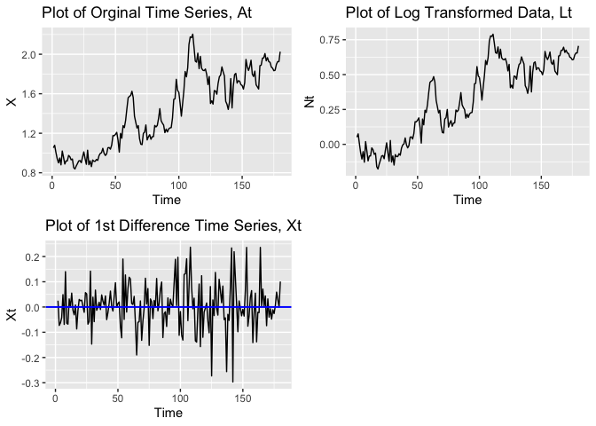
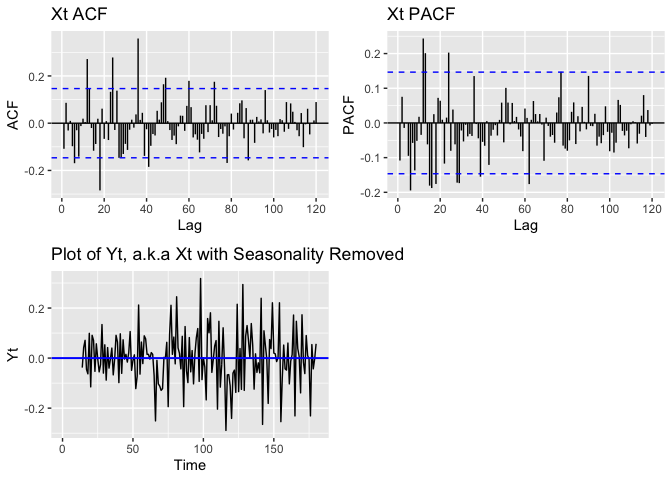

    library(ggplot2)
    library(forecast)

    ## Warning: package 'forecast' was built under R version 3.6.2

    library(fpp)
    library(gridExtra)
    library(astsa)
    library(forecast)
    library(TSA)
    library(cowplot)

    ## Warning: package 'cowplot' was built under R version 3.6.2

    library(dplyr)

### Introduction:

This Data Set contains 180 data points with column one representing time
(in months) and column two representing some unknown observations.  

load the dataset

    data1 <- read.csv("./data1.csv")

### 1 Exploratory Data Analysis

#### 1.1 Stationarity & Variance

Let’s define the our initial Time Series as *A**t*.
   We began our EDA by first observing its general trend and
shape (Figure 1.1a). Through its obvious upward trend,
heteroscedasticity, and potential seasonality, we understood that it was
clearly not stationary time series. Thus, to address the issue, we began
our journey to make predictions by conducting a variance stabilizing
transformation followed by differencing in order to achieve stationary
data for the purpose of using an appropriate (M)(S)ARIMA
model.  

To remove the unstationarities, we do the following transformations:
  1) Take Logarithm (*A**t* −  &gt; *L**t*) :
*L**t* = *l**o**g**A**t*   2) Take First
Difference (*L**t* −  &gt; *X**t*) :
*X**t* = *L**t* − *L**t* − 1

    # figure 1.1a
    plot1 <- ggplot() +
      geom_line(data = data1, aes(X, x), color = "black")  + labs(title="Plot of Orginal Time Series, At",
            x ="Time", y = "X")

    # figure 1.1b  take logarithm
    data1 <- data1 %>% mutate(Lt = log(data1$x))
    plot2 <- ggplot() +
      geom_line(data = data1, aes(X, Lt), color = "black")  + labs(title="Plot of Log Transformed Data, Lt",
            x ="Time", y = "Nt")

    # figure 1.1c  take 1st difference
    data1 <- data1 %>% mutate(Xt = c(NA, diff(data1$x, lag = 1)))
    plot3 <- ggplot() +
      geom_line(data = data1, aes(X, Xt), color = "black") + geom_hline(yintercept = 0, 
                    color = "blue", size=0.7) + labs(title="Plot of 1st Difference Time Series, Xt",
            x ="Time", y = "Xt")

    grid.arrange(plot1, plot2, plot3, ncol = 2)

1.2 ACF & PACF of Xt Looking at Figure 1.2a, we observe that the ACF and
PACF of *X**t* are significant at around lag 6, 12, 18, 24,
a.k.a implying a seasonal pattern of 6 periods. This is suggesting us to
remove the seasonalities by differencing.

1.3 Seasonal differencing  Take Sixth Difference on
*X**t* (*X**t* −  &gt; *Y**t*) :
*Y**t* = *X**t* − *X**t* − 6

    p1 <- ggAcf(data1$Xt, lag.max = 120)+ ggtitle("Xt ACF")
    p2 <- ggPacf(data1$Xt, lag.max = 120) + ggtitle("Xt PACF")
    #grid.arrange(p1, p2, nrow = 2)

    data1 <- data1 %>% mutate(Yt = c(NA, NA,NA,NA,NA,NA, diff(data1$Xt, lag = 6)))
    plot4 <- ggplot() +
      geom_line(data = data1, aes(X, Yt), color = "black") + geom_hline(yintercept = 0, 
                    color = "blue", size=0.7) + labs(title="Plot of Yt, a.k.a Xt with Seasonality Removed",
            x ="Time", y = "Yt")

    grid.arrange(p1, p2,plot4, nrow = 2)

    adf.test(na.remove(data1$Yt))

    ## 
    ##  Augmented Dickey-Fuller Test
    ## 
    ## data:  na.remove(data1$Yt)
    ## Dickey-Fuller = -12.632, Lag order = 5, p-value = 0.01
    ## alternative hypothesis: stationary

1.4 select a model  Augmented Dicky-Fuller test indicates if the
data correponds to a stationary process, and the above test shows
*Y**t* is significant at 0.01 confidence level. Therefore, we
are quite convinced that *Y**t* is a stationary process.
We’ll fit an ARMA model from here.  From PACF, we see significant
lags at lag4, lag5, lag7, lag9, lag14; from the ACF, we still see a
seasonal pattern at period of 5. Since a seansonal differencing has
applied here, it’s reasonable to propose a GARCH model here(we’ll
discuss this in Second Section). But we’ll stick to SARIMA within this
section.

    p3 <- ggAcf(data1$Yt, lag.max = 60)+ ggtitle("Yt ACF")
    p4 <- ggPacf(data1$Yt, lag.max = 60) + ggtitle("Yt PACF")
    grid.arrange(p3, p4, nrow = 2)

1.5 Demo Fit an ARMA model on *Y**t* Based on the ACF and
PACF, we’ll fit ARMA data on *Y**t*, A.K.A a
*S**A**R**I**M**A*(*p*, 1, *q*) \* (*P*, 1, *Q*)6 Model on
the log transformed of original data(*L**t*). Since there’s
not an explicit obvious ARMA pattern given in *Y**t*, a few
options are proposed here and we will later on make a model selection
based on the Cross Validation results.  Option1 : ARMA(4,1) |||
Reason: We have two very relevant AR factor ar1 ar3, as well as an MA
factor ma1

    ## Model 1 summary
    model1 <- arma(na.remove(data1$Yt), order = c(4,2), include.intercept = FALSE)
    summary(model1)

    ## 
    ## Call:
    ## arma(x = na.remove(data1$Yt), order = c(4, 2), include.intercept = FALSE)
    ## 
    ## Model:
    ## ARMA(4,2)
    ## 
    ## Residuals:
    ##      Min       1Q   Median       3Q      Max 
    ## -0.32018 -0.07904 -0.01353  0.07119  0.35054 
    ## 
    ## Coefficient(s):
    ##      Estimate  Std. Error  t value Pr(>|t|)    
    ## ar1   0.38979     0.07064    5.518 3.43e-08 ***
    ## ar2   0.54948     0.13089    4.198 2.69e-05 ***
    ## ar3  -0.01142     0.11018   -0.104    0.917    
    ## ar4  -0.36146     0.07241   -4.992 5.98e-07 ***
    ## ma1  -0.48947     0.01586  -30.867  < 2e-16 ***
    ## ma2  -0.59197     0.01955  -30.278  < 2e-16 ***
    ## ---
    ## Signif. codes:  0 '***' 0.001 '**' 0.01 '*' 0.05 '.' 0.1 ' ' 1
    ## 
    ## Fit:
    ## sigma^2 estimated as 0.01503,  Conditional Sum-of-Squares = 2.53,  AIC = -223.23

    ## plot the Yt_hat and Yt
    model1_perf <- data.frame(c(1:180), c(NA, NA,NA,NA,NA,NA,NA, model1$fitted.values))
    x <- c("X", "Yt_fitted")
    colnames(model1_perf) <- x

    #plot5 <- ggplot() +
    ##  geom_line(data = data1, aes(X, model1_pred), color = "black") +
    #  geom_line(data = data1, aes(X, Yt), color = "red") + ggtitle("model1, Yt red, Yt_fitted black")+
    #  geom_hline(yintercept = 0, color = "blue", size=0.7) 
      
    #plot5

1.6 From here we’ll officially comparing a few potential models, to
avoid the redundance procedures above, we won’t repeat the above process
for tidyness, but they are essentially similar. Instead, to give better
interpretation, we’ll leverage the SARIMA and SARIMA.for functions for
our model validation process. For consistency purpose, we would also
apply the SARIMA function on it again.  

Model1:

    sarima.noplot = function(x) {
      png(tf<-tempfile())
      out <- sarima.for(x, p=4, d=1, q=2, P=0, D=1, Q=0, S = 12,n.ahead = 12)
      dev.off()
      file.remove(tf)
      return(out)
    }

    sarima.noplot(data1$Lt)

    ## Warning in log(s2): NaNs produced

    ## Warning in log(s2): NaNs produced

    ## $pred
    ## Time Series:
    ## Start = 181 
    ## End = 192 
    ## Frequency = 1 
    ##  [1] 0.6689945 0.7018705 0.6854186 0.6775948 0.6445388 0.6374632 0.6282993
    ##  [8] 0.6355440 0.6663835 0.6769867 0.6747376 0.7274834
    ## 
    ## $se
    ## Time Series:
    ## Start = 181 
    ## End = 192 
    ## Frequency = 1 
    ##  [1] 0.06835722 0.08183900 0.10111095 0.12251906 0.14516423 0.16219509
    ##  [7] 0.17430588 0.18482541 0.19654125 0.20942864 0.22146368 0.23150976

    #pred_value = matrix(0, nrow = 180, ncol = 1)
    #i = 1
    ##while(i <= 156){
    #  data1sub = data1$Lt[data1$X < i + 24]
    #  # model1
    #  cvmodel1 <- sarima.for(data1sub, p=4, d=1, q=2, P=0, D=1, Q=0, S = 12, n.ahead = 12)
    #  pred_value[(24+i):(35+i),] <- exp(cvmodel1$pred)
    #  i = i + 12
    #}

    #pred_value <- data.frame(c(1:180),pred_value)
    #ggplot() + 
    #  geom_line(data = data1, aes(X, x), color = "black")  +labs(title="Plot of Orginal Time Series", x ="Time", y = "X") + #geom_line(data = pred_value, aes(c.1.180., pred_value), color = "red")

    sarima.for(data1$Lt, p=4, d=1, q=2, P=0, D=1, Q=0, S = 12,n.ahead = 12)

    ## Warning in log(s2): NaNs produced

    ## Warning in log(s2): NaNs produced

    ## $pred
    ## Time Series:
    ## Start = 181 
    ## End = 192 
    ## Frequency = 1 
    ##  [1] 0.6689945 0.7018705 0.6854186 0.6775948 0.6445388 0.6374632 0.6282993
    ##  [8] 0.6355440 0.6663835 0.6769867 0.6747376 0.7274834
    ## 
    ## $se
    ## Time Series:
    ## Start = 181 
    ## End = 192 
    ## Frequency = 1 
    ##  [1] 0.06835722 0.08183900 0.10111095 0.12251906 0.14516423 0.16219509
    ##  [7] 0.17430588 0.18482541 0.19654125 0.20942864 0.22146368 0.23150976
